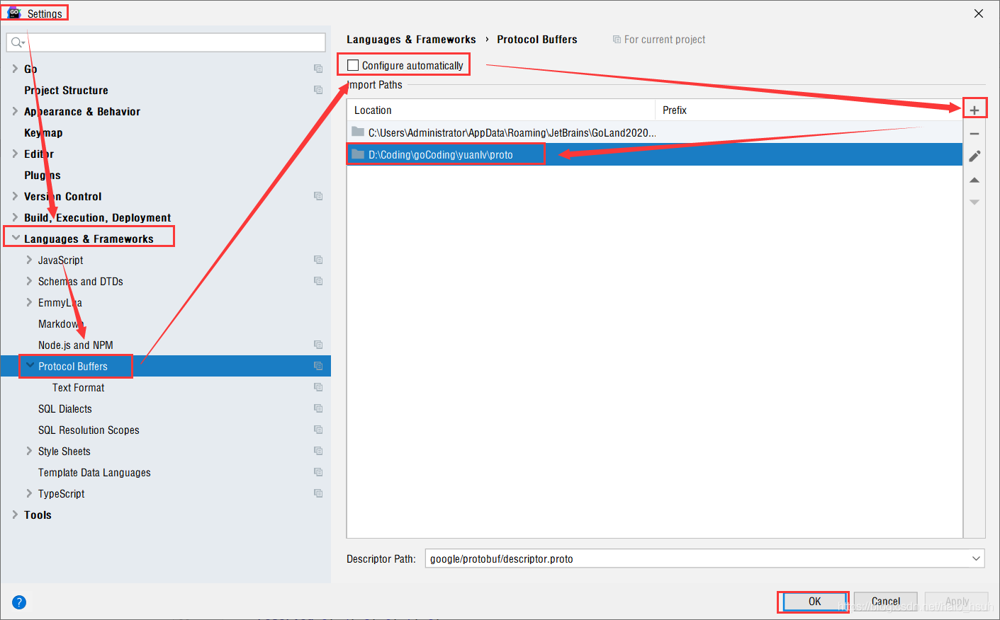

# 7.双向认证下rpc-gateway使用（同时提供rpc和http接口）

####（同时提供rpc和http接口） 
第三方库地址：https://github.com/grpc-ecosystem/grpc-gateway
```bash
$ go install \
    github.com/grpc-ecosystem/grpc-gateway/protoc-gen-grpc-gateway \
    github.com/grpc-ecosystem/grpc-gateway/protoc-gen-swagger \
    github.com/golang/protobuf/protoc-gen-go
```

同时提供gRPC和RESTful风格的api。


在grpc上加一层代理并转发，转变成protobuf格式来访问grpc服务


解决import时候出现的Cannot resolve import 'xxxxx.proto'  问题

去除勾选自动配置， 添加自己proto文件的路径，在import的时候就不会报找不到文件的错误了

* 修改server/pbfiles/Prod.proto, 添加option相关代码
* 重新生成Prod.pb.go
```bash
cd server/pbfiles
protoc --go_out=plugins=grpc:../services Prod.proto
```
```bash
cd server/pbfiles
protoc --grpc-gateway_out=logtostderr=true:../services Prod.proto

```

运行grpc服务
```bash
cd server
go run server.go
```
运行httpServer服务
```bash
cd server
go run httpserver.go
```
打开浏览器访问
```bash
http://localhost:8080/v1/prod/20
```