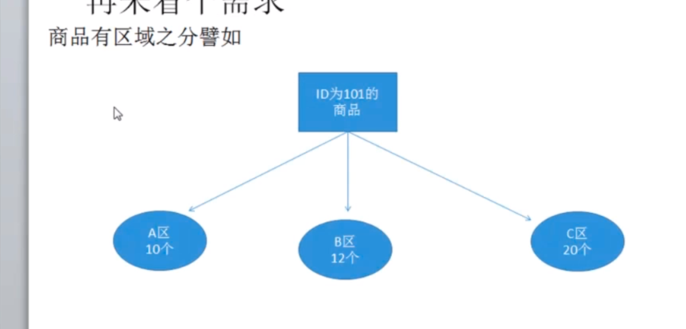

# 9.语法速学(2) 使用枚举获取分区商品库存


需求：  
 上节课我们实现的是传入一个商品ID获取一个商品库存。
也实现了获取 **一堆** 商品的库存，如果库存分多个区（如A/B/C),客户端需要指定获取的库存区号，否则默认返回A区的。

本节：
1.传入一个商品ID，获取一个商品库存
2.根据size获取一堆商品的库存列表
3.创建枚举类型，支持分区枚举参数



加入枚举类型：
```go
enum ProdAreas{
    A = 0;  //第一个必须是0，代表一个默认值
    B = 1;
    C = 2;
}
```


* 启动服务端
```bash
cd server
go run server.go
```
* 启动客户端连接并查询
```bash
cd client
go run main.go
```