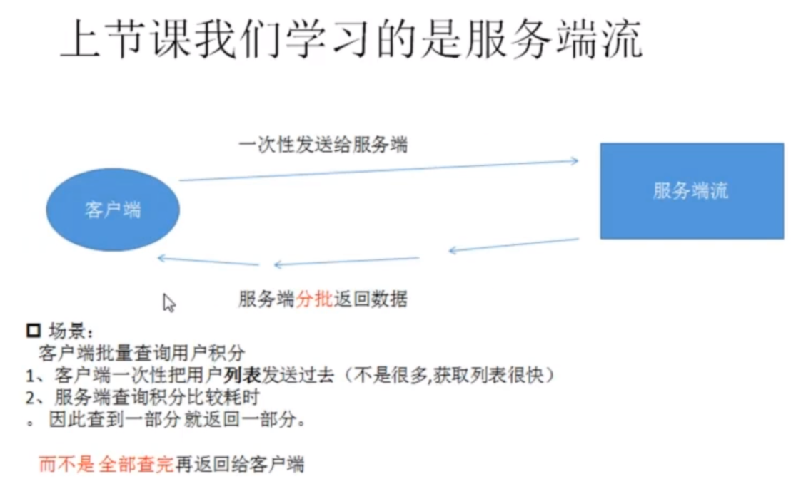

# 18.客户端流模式 
场景：分批发送请求

上节课场景：


## 场景反过来
场景：
    客户端批量查询用户积分
1、客户端一次性把用户列表发送过去（客户端获取列表比较慢）
2、服务端查询积分比较快
——>此时就可以用客户端流模式


* 启动服务端
```bash
cd server
go run server.go
```
* 启动客户端
```bash
cd client
go run main.go
```
